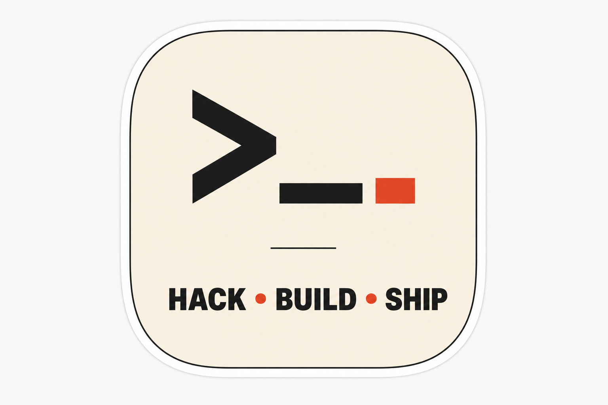
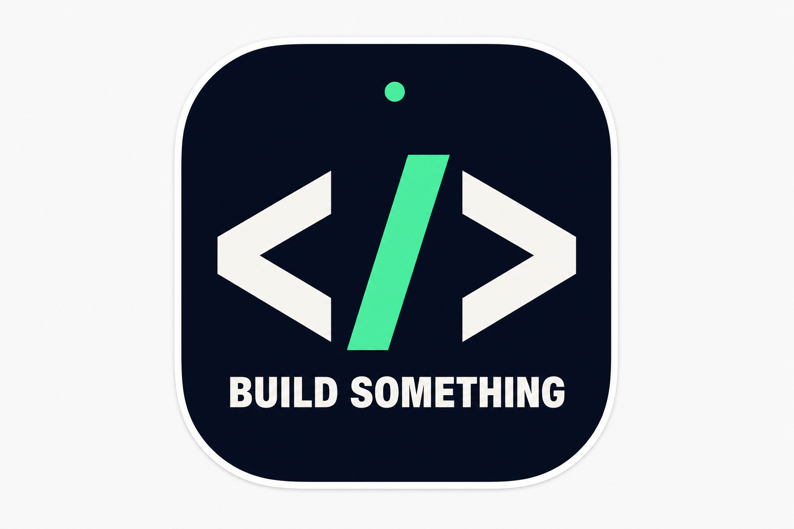
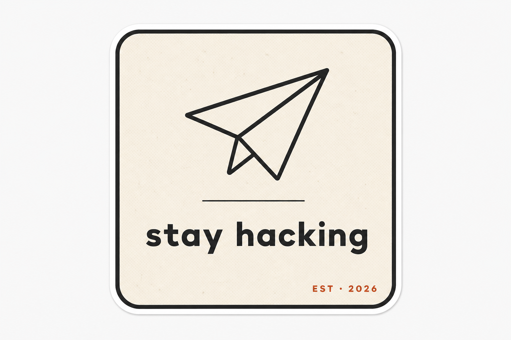

# Hackathon Sticker — Design Options

Three minimal, designer-grade die-cut vinyl sticker concepts for the hackathon. All
are sized for a ~3 inch die-cut, include a 1/8" white print border for cutting
tolerance, use a strict 2–3 word copy rule, and are built around a single
bold typographic mark so they read across a room and look at home on a laptop lid.

Web research informed the direction: the best laptop stickers are intentional
(distinct visual style, not generic), use restrained color palettes that pop on
dark lids, and lean on one strong icon plus very short copy.

## Option A — `HACK · BUILD · SHIP`

- Shape: squircle, ~3"
- Palette: cream (#F4ECD9) + charcoal + tomato red (#E94B35)
- Mark: oversized terminal prompt `>_` with a small red block cursor
- Vibe: Stripe / Linear / Vercel — confident, classic, universal
- Best for: general giveaway, will look great on any laptop

## Option B — `BUILD SOMETHING`

- Shape: squircle, ~3"
- Palette: midnight navy (#0B1020) + off-white + electric mint (#3DF5A1)
- Mark: oversized `</>` with the slash glowing mint, status dot above
- Vibe: GitHub dark mode / Raycast — bold, techy, pops hard on silver MacBooks
- Best for: a sticker that demands attention

## Option C — `stay hacking`

- Shape: rounded square, ~3"
- Palette: bone (#F2EDE3) + charcoal + brick red (#C04A2B) accent
- Mark: monoline paper airplane, hairline divider, tiny `EST · 2026` stamp
- Vibe: Notion / Field Notes — warm, designer, indie
- Best for: a sticker that designers and non-devs will also want

## Print specs (all three)

- Size: 3" × 3" die-cut vinyl
- Bleed: 1/8" white border around cut line (already included)
- Finish: matte laminate recommended (less glare on laptop lids, more premium)
- Color mode: convert to CMYK before sending to printer; check the red/mint
  accents on a proof — vivid spot colors can shift on press
