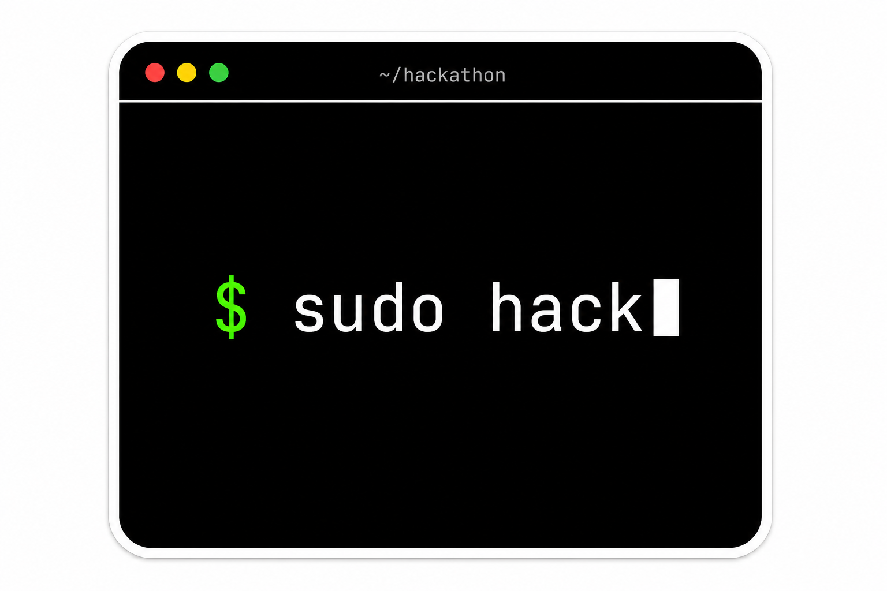
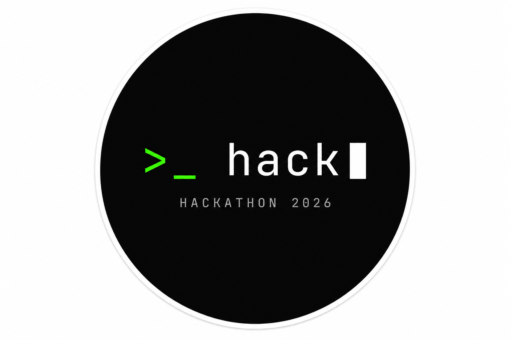
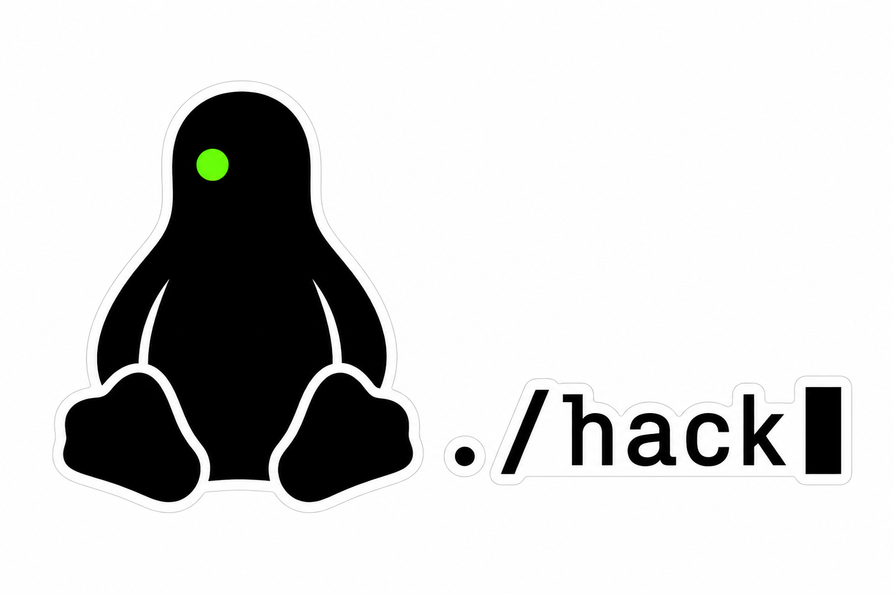

# Hackathon Stickers

Three minimal die-cut sticker concepts with a programming / Linux / hacker terminal vibe.
All designs are intentionally restrained — high contrast, monospace type, 2–3 words max — so they
look at home on any laptop lid without screaming for attention.

## 1. Terminal Window — `$ sudo hack`

- Shape: rounded-rectangle terminal window (die-cut)
- Palette: matte black, white outline, neon green prompt, white block cursor
- Title bar: `~/hackathon` with macOS-style traffic lights
- Words: **sudo hack** (2 words)
- Vibe: classic shell prompt, instantly readable as Linux + hacker

## 2. Circular Badge — `>_ hack`

- Shape: circle (die-cut)
- Palette: matte black, white outline, neon green `>_`, white text + cursor
- Subtext: small `HACKATHON 2026` underneath
- Words: **hack** (1 hero word + small event tag)
- Vibe: compact community badge, mixes well with other stickers

## 3. Tux Penguin — `./hack`

- Shape: modernised Tux silhouette (die-cut), paired with a small `./hack` chip
- Palette: solid black, white outline, single neon green "LED" eye
- Words: **./hack** (1 command)
- Vibe: open-source heritage with a hacker twist
